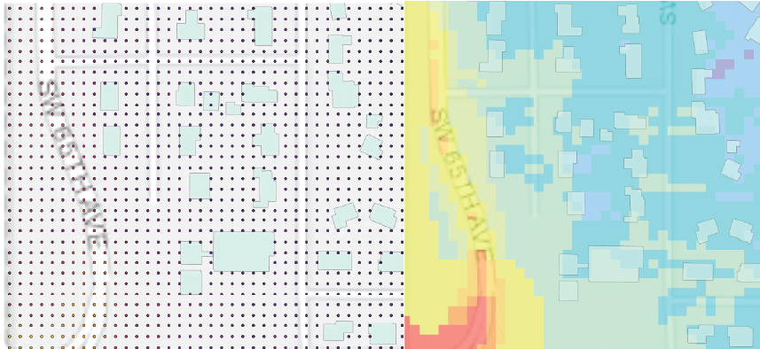

# Create Raster Surface
Stage 5 of the workflow pipeline.  Create raster surfces of DNL and LEQ levels across Portland, OR (10m resolution)

### Files ###
**[createRasters.py](https://github.com/larkinandy/PDXNoiseSurface/blob/main/CreateRasterSurface/createRasters.py)** - using csv files of predicted noise levels, create and clean raster surfaces for DNL and LEQ.
