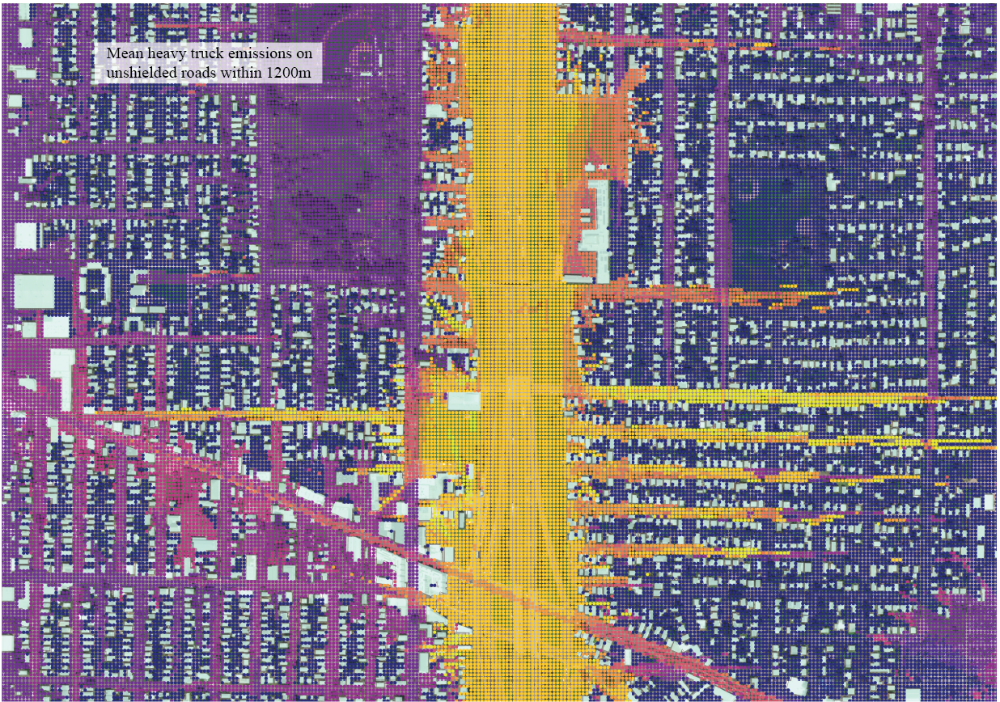

# Derive Predictor Metrics
Stage 3 of the pipeline. Using preprocessed datasets, calculate variable metrics used in the land use regression model (e.g. average speed of vehicles driving on primary roads within 20m)

### Files ###
**[calcIsShielding.py](https://github.com/larkinandy/PDXNoiseSurface/blob/main/DerivePredictorMetrics/calcIsShielding.py)** - for each grid point, determine which roads are shielded by buildings  
**[calcMiscMetrics.py](https://github.com/larkinandy/PDXNoiseSurface/blob/main/DerivePredictorMetrics/calcMiscMetrics.py)** - calculate metrics for each variable not directly attached to the road network polyline file or NDVI (e.g. number of street lights, bus routes, bicycle routes)   
**[calcNDVIBuffers.py](https://github.com/larkinandy/PDXNoiseSurface/blob/main/DerivePredictorMetrics/calcNDVIBuffers.py)** - calculate NDVI metrics.  NDVI is the only variable in raster format  
**[calcRdMetrics.py](https://github.com/larkinandy/PDXNoiseSurface/blob/main/DerivePredictorMetrics/calcRdMetrics.py)** - calculate road metrics for those that do not involve a shield modifier  
**[calcShieldingMetrics.py](https://github.com/larkinandy/PDXNoiseSurface/blob/main/DerivePredictorMetrics/calcShieldingMetrics.py)** - calculate road metrics for those that do leverage a shield modifier  
