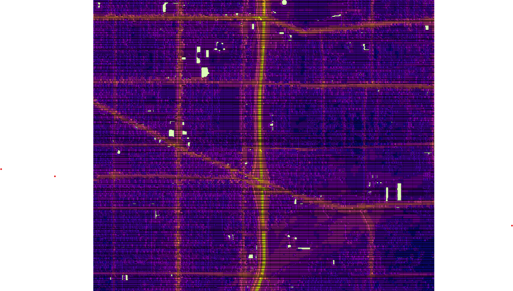

# Predict LEQ and DNL
Stage 4 of the workflow pipeline.  Using a linear regression model predict LEQ and DNL levels for 10m grid points across Portland, OR.  

### Files ###
**[predictGirdPointsDNL.py](https://github.com/larkinandy/PDXNoiseSurface/blob/main/PredictLEQAndDNL/predictGridPointsDNL.py)** - predict DNL levels and save predictions and variable contributions in a .csv file  
**[calcMiscMetrics.py](https://github.com/larkinandy/PDXNoiseSurface/blob/main/PredictLEQAndDNL/predictGridPointsLEQ.py)** - predict LEQ levels and save predictions and variable contributions in a .csv file  
