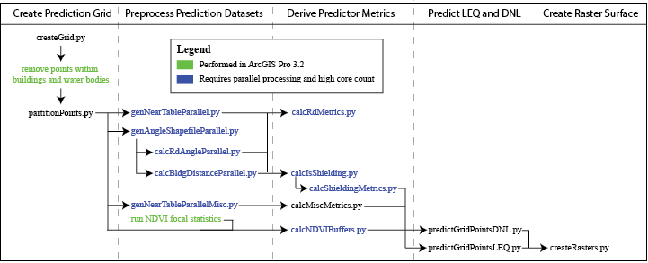

# PDXNoiseSurface
 Create a 10m surfce of outdoor LEQ noise levels in Portland, OR

//
TODO: add noise surface map

**Author:** [Andrew Larkin](https://www.linkedin.com/in/andrew-larkin-525ba3b5/)  
**Affiliation:** [Oregon State University, College of Health](https://health.oregonstate.edu/))  
**Principal Investigator:** [Matthew Bozigar](https://health.oregonstate.edu/directory/matthew-bozigar)  
**Date Created:** March 22nd, 2024

### Summary ###
This repo contains scripts and accompanying documentation used to create outdoor noise surface estimates (LEQ) for Portland, OR at 10m resolution.

### Model Structure ###
Predictions were created with a land use regression model.  Variables for the model were selected using LASSO penalized variable selection. Model variables are:
| Variable  | Buffer (m) | Statistic | IDW | Road Type  | Shield Adjustment  | 
| ------------- | ------------- | ------------- | ------------- | ------------- | ------------- |
| percent cars  | 10  | mean  | False  | tertiary/unclassified  | unshielded roads only  |
| bus routes  | 10  | mean  | NA  | NA  | NA  |
| NDVI  | 10  | mean  | NA  | NA  | NA  |
| AADT  | 20  | mean  | False  | all road types  | unshielded roads only  |
| emergency vehicle routes  | 20  | mean  | False  | NA  | NA  |
| street lights  | 20  | mean  | False  | NA  | NA  |
| bicycle routes | 20  | mean  | False  | NA  | NA  |
| percent cars | 50  | mean  | False  | primary/secondary  | unshielded roads only  |
| vehicle speed | 250  | quantile  | False  | residential  | unshielded roads only  |
| vehicle speed  | 450  | sum  | False  | tertiary/unclassified | unshielded roads only  |
| NDVI  | 450  | sum  | NA  | NA | NA  |
| percent cars | 700  | mean  | True  | primary/secondary  | shielded and unshielded roads  |
| percent heavy trucks | 800  | mean  | False  | primary/secondary  | unshielded roads only  |
| percent heavy trucks | 1200  | sum  | False  | primary/secondary  | unshielded roads only  |
| heavy truck emissions | 1200  | mean  | False  | primary/secondary  | unshielded roads only  |
| percent medium trucks  | 1400  | quantile  | True  | primary/secondary | unshielded roads only  |
| percent cars | 2000  | mean  | True  | tertiary/unclassified  | unshielded roads only  |

abbreviations: IDW - Inverse Distance Weighted, NDVI - normalized difference vegetation index, AADT - Annual Average Daily Traffic 

### Data Pipeline ###
Generating predictions at 10m resolution (6.5 million points) within 2 weeks required adopting a distributed computing workflow.  Tasks were broken up into microservices, similar to containers or pods in a Kubernetes workflow.  Tasks with high parallelizability were assigned to 64-core workstations, while other tasks were assigned to 16-core workstations.  The dependencies betweeen tasks are shown in the flow diagram below.

TODO; update workflow as scripts are added to repo

### Repo Structure ###
Scripts are seperated into folders, one folder for each stage of the data pipeline:
CreatePartitionGrid - create and refine a grid of points across Portland, OR at 10m resolution
PreprocessPredictionDtasets - Using parallel computing, calculate metrics such as distance and radial degree needed for deriving predictor metrics
DerivePredictorMetrics - calculate metrics used in linear reqression equations
PredictLEQAndDNL - claculate LEQ and DNL for each point using linear regression equations
CreateRasterSurface - georeference noise predictions and refine for final prediction surfaces

### External Links ###
**External links**
- **publication** - TODO: update once published
- **noise surface** - TODO: link to noise predictions
- **funding agency** - TODO: add link to funding agency
- **LASSO variable selection** - https://github.com/larkinandy/LUR-NO2-Model/tree/master/statistical%20analysis
